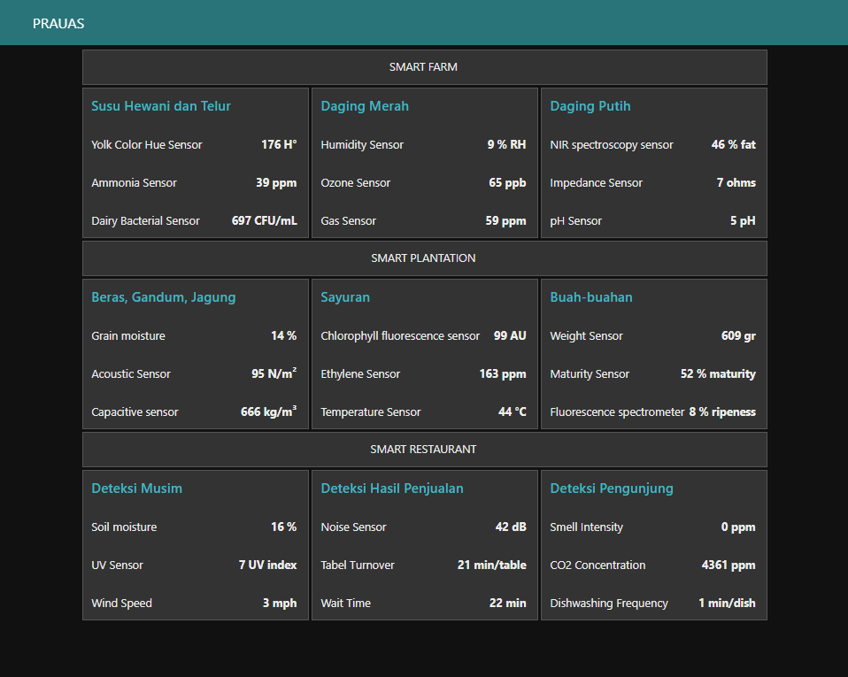
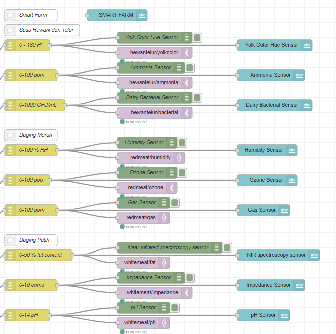
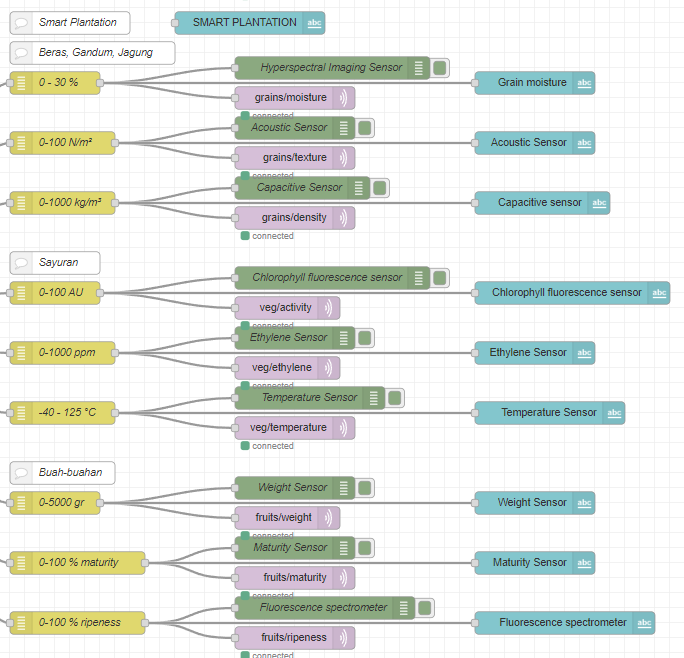
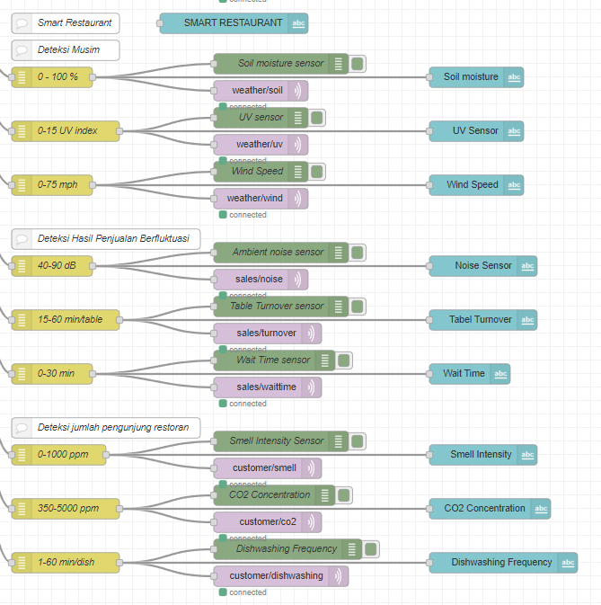
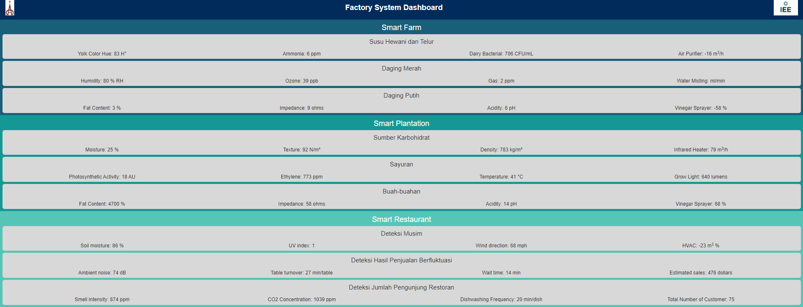

# PraUAS
Tugas PraUAS Mata Kuliah Pemrograman Berbasis Web untuk IoT

## Progress 3 07/05/23
1. Apa saja yang sudah dilakukan?
    - Node-red sensor simulator Sistem Smart Farm dan Smart Plantation
    - Node-red UI sensor smart farm dan smart plantation
    - MQTT communication to django server
    - Basic UI
    - sensor simulator and ui for smart restaurant
    - beautify node-red ui
    - machine learning untuk tiap subsystem (untuk aktuator pabrik dan aktuator yang mengambil input dari ketiga aktuator pabrik masih dipikirkan)
    - Django UI
    
    
    
    
    
2. Apa saja kendala yang dihadapi?
    - Mencari UI yang enak dilihat dan simpel diimplementasi
3. Apa yang sudah dilakukan untuk mengatasi kendala tersebut?
    - cari di internet via pinterest, dribbble
4. Apa rencana yang akan dikerjakan berikutnya?
    - Django UI

