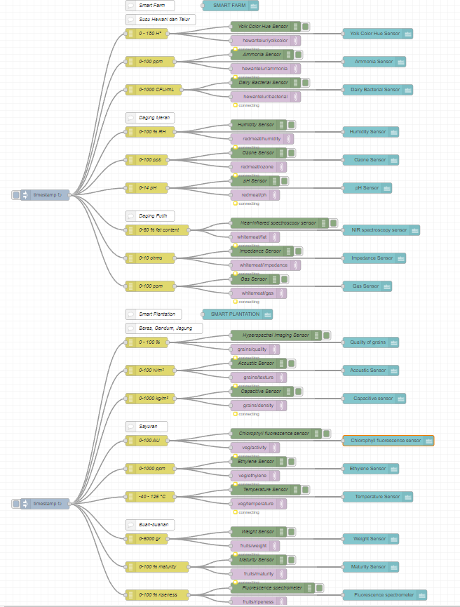

# PraUAS
Tugas PraUAS Mata Kuliah Pemrograman Berbasis Web untuk IoT

## Progress 1 30/04/23
1. Apa saja yang sudah dilakukan?
    - Node-red sensor simulator Sistem Smart Farm dan Smart Plantation 
    - Node-red UI sensor smart farm dan smart plantation
    - MQTT communication to django server
    - Basic UI 
    
    
2. Apa saja kendala yang dihadapi?
    - mencari sensor yang unik untuk semua sensor
    - informasi yang kurang jelas untuk smart restaurant
3. Apa yang sudah dilakukan untuk mengatasi kendala tersebut?
    - cari di internet soal sensor yang tidak convensional, yang teknologinya tidak lazim
    - bertanya kepada pak Jayandi untuk memperjelas smart restaurant
4. Apa rencana yang akan dikerjakan berikutnya?
    - Mencari sensor untuk smart restaurant setelah sudah jelas disampaikan
    - Menyelesaikan aktuator yang mengambil aktuator lain sebagai input.
